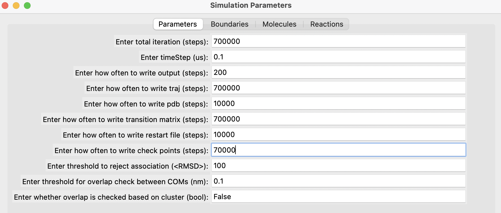
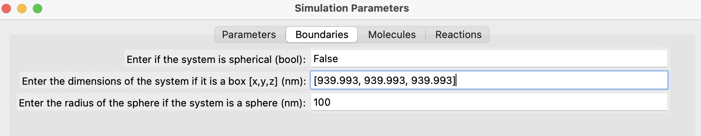
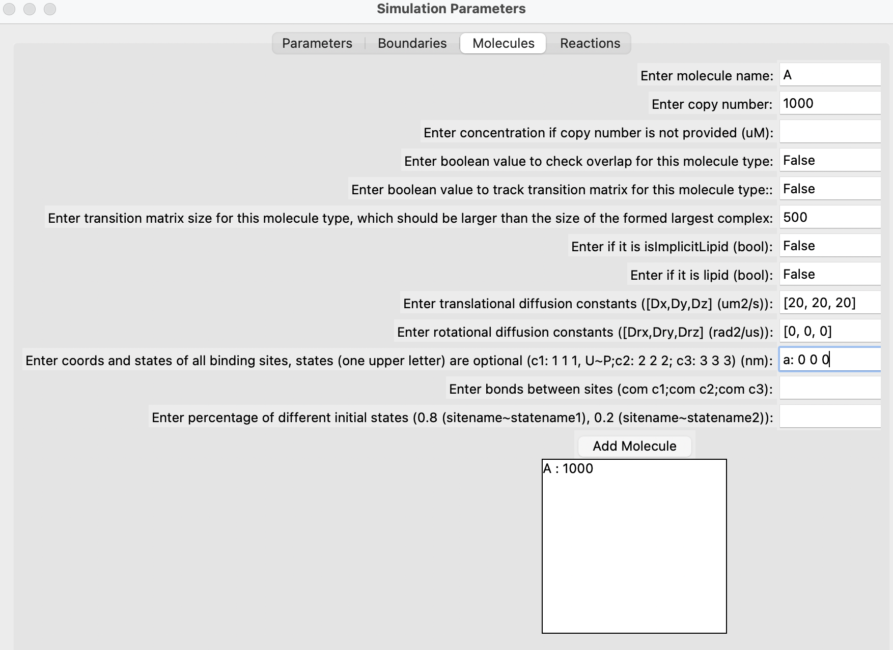
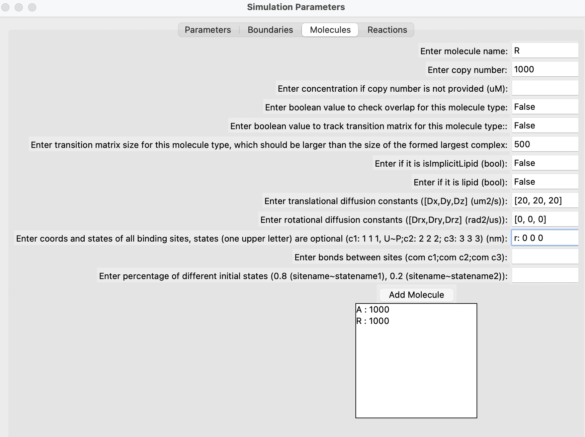
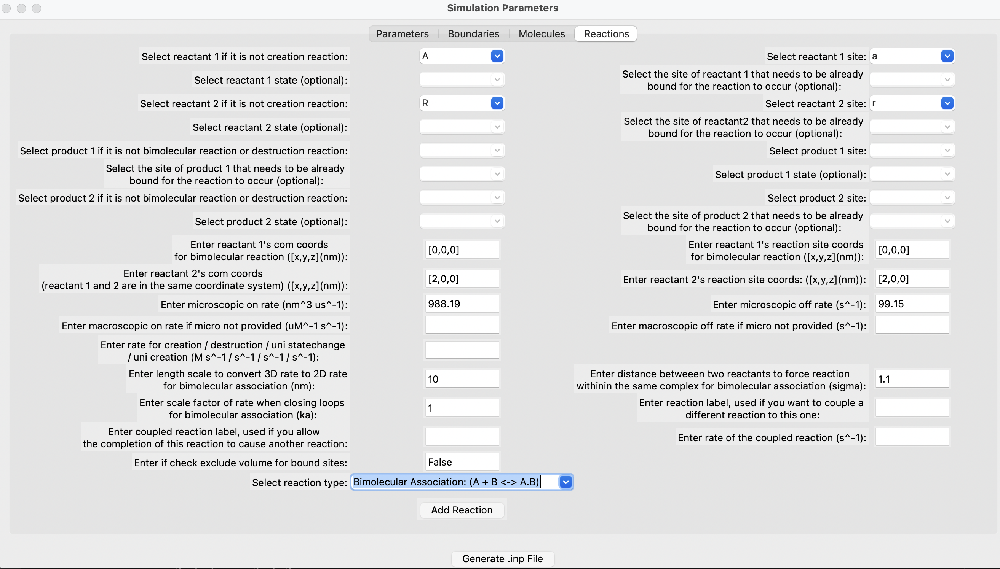

# Running a Basic NERDSS Simulation

After installing NERDSS, let's run a basic simulation to understand its philosophy. We will simulate the reversible reaction A(a) + R(r) <-> A(a!1).R(r!1) in a 3D solution. For a comprehensive guide to using NERDSS, please refer to [user guide](https://github.com/mjohn218/NERDSS/blob/master/NERDSS_USER_GUIDE.pdf) in the NERDSS repository.

## Prepare the .inp file for the simulation

Following is the content of the .inp file that we will use in the simulaiton . You can download it [here](./NERDSSInputs/basic.inp). Please refer to [user guide](https://github.com/mjohn218/NERDSS/blob/master/NERDSS_USER_GUIDE.pdf) in the NERDSS repository for the explanation of each parameter.

```bash
start parameters
    nItr = 700000 # steps
    timeStep = 0.1 # us
    timeWrite = 200 # steps
    pdbWrite = 10000 # steps
	checkPoint = 70000 # steps
    restartWrite = 10000 # steps
end parameters

start boundaries
    WaterBox = [939.993,939.993,939.993] # nm
end boundaries

start molecules
    A : 1000
    R : 1000
end molecules

start reactions
    A(a) + R(r) <-> A(a!1).R(r!1)
        onRate3Dka = 988.19 # 3D microscopic binding rate, nm^2/us
        offRatekb = 99.15 # microscopic dissociation rate, s^-1
        norm1 = [0,0,1]
        norm2 = [0,0,1]
        sigma = 2.0
        assocAngles = [nan,nan,nan,nan,nan]
        bindRadSameCom = 1.1
end reactions
```

## Prepare the .mol files for the molecule types in the simulation

The following A.mol file is needed for the simulation and can be downloaded from [here](./NERDSSInputs/A.mol).

```bash
name    = A

# translational diffusion constants
D       = [20.0,20.0,20.0]

# rotational diffusion constants
Dr      = [0.0,0.0,0.0]

# Coordinates
COM     0.0000    0.0000    0.0000
a       0.0000    0.0000    0.0000
```

The following R.mol file is also required for the simulation and can be downloaded from [here](./NERDSSInputs/R.mol).
```bash
name    = R

# translational diffusion constants
D       = [20.0,20.0,20.0]

# rotational diffusion constants
Dr      = [0.0,0.0,0.0]

# Coordinates
COM     0.0000    0.0000    0.0000
r       0.0000    0.0000    0.0000
```

Please refer to [user guide](https://github.com/mjohn218/NERDSS/blob/master/NERDSS_USER_GUIDE.pdf) in the NERDSS repository for the explanation of each parameter.

## Use the GUI provided in the ioNERDSS library to generate the .inp and .mol files (optional)

You can generate input files using the GUI provided by the ioNERDSS library. After installing ioNERDSS using pip, start a Python interpreter and run the following command to start the GUI:

```python
import ioNERDSS as ion
ion.gui()
```

Fill out the parameters in the different sections, add each molecule one by one, followed by each reaction. Finally, click on the "Generate" button. Below are some snapshots.











## Run the simulation

### Run the simulation in the local environment

### Run the simulation using Docker

## Outputs of the simulation

### Analyze the output using ioNERDSS

### Render movies for the trajectory
