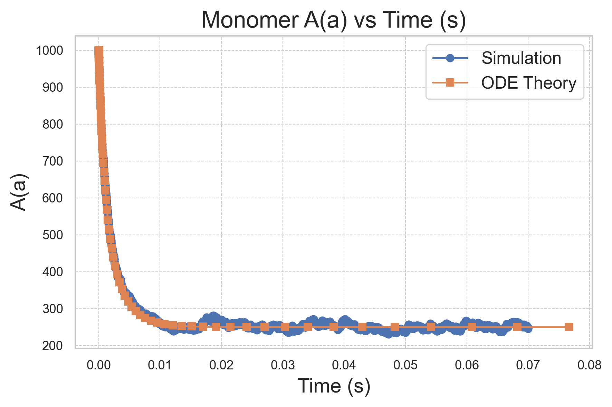

# Running a Basic NERDSS Simulation

After installing NERDSS, let's run a basic simulation to understand its philosophy. We will simulate the reversible reaction A(a) + R(r) <-> A(a!1).R(r!1) in a 3D solution. For a comprehensive guide to using NERDSS, please refer to [user guide](https://github.com/mjohn218/NERDSS/blob/master/NERDSS_USER_GUIDE.pdf) in the NERDSS repository.

## Prepare the .inp file for the simulation

Following is the content of the .inp file that we will use in the simulaiton . You can download it [here](./NERDSSInputs/basic.inp). Please refer to [user guide](https://github.com/mjohn218/NERDSS/blob/master/NERDSS_USER_GUIDE.pdf) in the NERDSS repository for the explanation of each parameter.

```bash
start parameters
    nItr = 700000 # steps
    timeStep = 0.1 # us
    timeWrite = 200 # steps
    pdbWrite = 10000 # steps
	checkPoint = 70000 # steps
    restartWrite = 10000 # steps
end parameters

start boundaries
    WaterBox = [939.993,939.993,939.993] # nm
end boundaries

start molecules
    A : 1000
    R : 1000
end molecules

start reactions
    A(a) + R(r) <-> A(a!1).R(r!1)
        onRate3Dka = 988.19 # 3D microscopic binding rate, nm^2/us
        offRatekb = 99.15 # microscopic dissociation rate, s^-1
        norm1 = [0,0,1]
        norm2 = [0,0,1]
        sigma = 2.0
        assocAngles = [nan,nan,nan,nan,nan]
        bindRadSameCom = 1.1
end reactions
```

## Prepare the .mol files for the molecule types in the simulation

The following A.mol file is needed for the simulation and can be downloaded from [here](./NERDSSInputs/A.mol).

```bash
name    = A

# translational diffusion constants
D       = [20.0,20.0,20.0]

# rotational diffusion constants
Dr      = [0.0,0.0,0.0]

# Coordinates
COM     0.0000    0.0000    0.0000
a       0.0000    0.0000    0.0000
```

The following R.mol file is also required for the simulation and can be downloaded from [here](./NERDSSInputs/R.mol).
```bash
name    = R

# translational diffusion constants
D       = [20.0,20.0,20.0]

# rotational diffusion constants
Dr      = [0.0,0.0,0.0]

# Coordinates
COM     0.0000    0.0000    0.0000
r       0.0000    0.0000    0.0000
```

Please refer to [user guide](https://github.com/mjohn218/NERDSS/blob/master/NERDSS_USER_GUIDE.pdf) in the NERDSS repository for the explanation of each parameter.

## Use the GUI provided in the ioNERDSS library to generate the .inp and .mol files (optional)

You can generate input files using the GUI provided by the ioNERDSS library. After installing ioNERDSS using pip, start a Python interpreter and run the following command to start the GUI:

```python
import ioNERDSS as ion
ion.gui()
```

Fill out the parameters in the different sections, add each molecule one by one, followed by each reaction. Finally, click on the "Generate" button. Below are some snapshots.


## Run the simulation

Make sure your .inp and .mol files are in the same folder. Navigate to that folder.

### Run the simulation in the local environment (Generally faster)

If you want to run NERDSS locally, add it to your PATH and start the simulation by running:

```bash
./nerdss -f <your-input-filename>.inp
```

### Run the simulation using Docker

If you are using Docker, start the simulation by running:

```bash
docker run -e RUN_NERDSS=true -e ANALYZE_OUTPUT=true -p 8888:8888 -v $(pwd):/SIMULATION -it sikaoguo/nerdsstutorial:latest
```

The simulation will then begin. The standard output is written to output.log. Once it is done, a Jupyter environment with `ioNERDSS` installed will be ready for use.

## Outputs of the simulation

The file [copy_numbers_time.dat](./NERDSSOutputs/basic/copy_numbers_time.dat) stores the time dependence of the copy numbers of all species in the system. Below are the first five lines of this file.

```bash
Time (s),A(a),R(r),A(a!1).R(r!1)
0,1000,1000,0
2e-05,990,990,10
4e-05,980,980,20
6e-05,966,966,34
```

The file [histogram_complexes_time.dat](./NERDSSOutputs/basic/histogram_complexes_time.dat) contains the time dependence of the complex components. The first ten lines of this file are shown below.

```bash
Time (s): 0
1000	A: 1.
1000	R: 1.
Time (s): 2e-05
990	A: 1.
10	A: 1. R: 1.
990	R: 1.
Time (s): 4e-05
980	A: 1.
20	A: 1. R: 1.
980	R: 1.
```

The simulation snapshots are stored in the `PDB/` folder and are in the PDB format.

### Analyze the output

We will create a plot of monomer A(a) vs Time (s) and compare the simulation result with the [ODE theory](./NERDSSOutputs/basic/theoryODE.dat).

```python
import pandas as pd
import matplotlib.pyplot as plt

# Read the simulation data from the file
sim_df = pd.read_csv('copy_numbers_time.dat', sep=',')

# Read the ODE theory data from the file
# Using regex to handle one or more spaces as the separator
ode_df = pd.read_csv('theoryODE.dat', sep=r'\s+', skipinitialspace=True)

# Plotting
plt.figure(figsize=(6, 4))  # Adjust the figure size (width, height) in inches
plt.plot(sim_df['Time (s)'], sim_df['A(a)'], 'o-', label='Simulation')
plt.plot(ode_df['time(s)'], ode_df['A(t)'], 's-', label='ODE Theory')

plt.xlabel('Time (s)', fontsize=14)
plt.ylabel('A(a)', fontsize=14)
plt.title('Monomer A(a) vs Time (s)', fontsize=16)
plt.legend(fontsize=12)
plt.grid(True, which='both', linestyle='--', linewidth=0.5)
plt.tight_layout()

# Save the figure in PNG format with a resolution of 300 dpi
plt.savefig('comparison_plot.png', dpi=300, bbox_inches='tight')

plt.show()
```



### Render movies for the trajectory

You can generate movies using the PDB format with OVITO.


