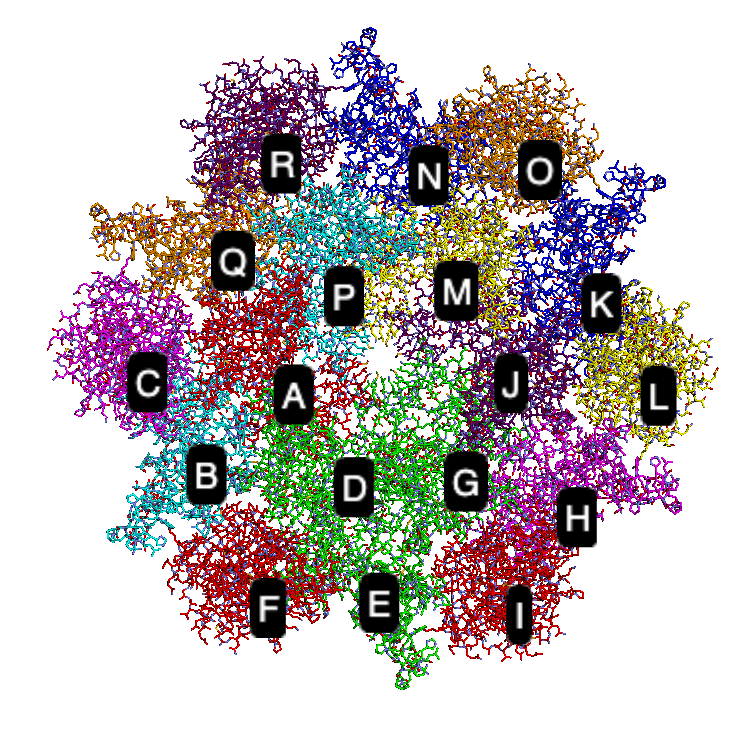

# Read PDB structures from the database and generate NERDSS inputs

This tutorial will explore how to generate inputs for NERDSS using the real PDB structure with the Virus Structure as an example. The PDB file we will use as the starting point can be found [here](./NERDSSInputs/pdbdemo/gag.pdb). Download the file and save it under your working directory.

## Install and Import the library

```bash
pip install ioNERDSS
pip install py3Dmol
```

```pthon
import ioNERDSS as ion
import py3Dmol
```

## Visualize the PDB structure

```python
def show_pdb_with_chain_labels(pdb_id):
    # Create a view with a specified width and height
    view = py3Dmol.view(width=800, height=400)
    
    # Add the PDB structure to the view
    with open(f"{pdb_id}.pdb", 'r') as f:
        pdb_data = f.read()
        view.addModel(pdb_data, format="pdb")
    
    # Get the distinct chains from the PDB data
    chains = set([line[21] for line in pdb_data.splitlines() if line.startswith("ATOM")])
    
    # Define colors (you can extend this list or generate colors dynamically)
    colors = ['red', 'green', 'blue', 'yellow', 'cyan', 'magenta', 'orange', 'purple']
    
    # Set visualization options for each chain
    for i, chain in enumerate(chains):
        view.setStyle({'chain': chain}, {'stick': {'colorscheme': f"{colors[i % len(colors)]}Carbon"}})
        
        # Compute the center of each chain manually
        x, y, z, count = 0.0, 0.0, 0.0, 0
        for line in pdb_data.splitlines():
            if line.startswith("ATOM") and line[21] == chain:
                x += float(line[30:38].strip())
                y += float(line[38:46].strip())
                z += float(line[46:54].strip())
                count += 1
        if count:
            x /= count
            y /= count
            z /= count
        
        # Add label for each chain
        view.addLabel(chain, {'position': {'x': x, 'y': y, 'z': z}, 'backgroundColor': 'black', 'fontColor': 'white'})
    
    view.zoomTo()
    
    # Show the visualization
    return view.show()

# Use the function to visualize the PDB file
show_pdb_with_chain_labels("gag")
```

You should be able to see the following image:



## Use ioNERDSS to construct the coarse-grained structure

```python
result1 = ion.dtb_PDB_separate_read(FileName='gag.pdb')
result2 = ion.dtb_PDB_calc_angle(Result=result1)
result3 = ion.dtb_PDB_norm_COM(Result=result2)
ion.dtb_PDB_write_input(Result=result3)
```

The inputs for NERDSS will be in the current folder.
