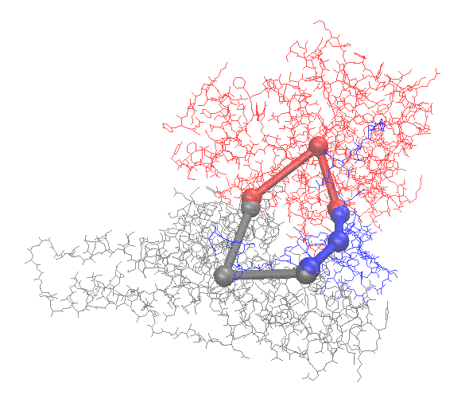
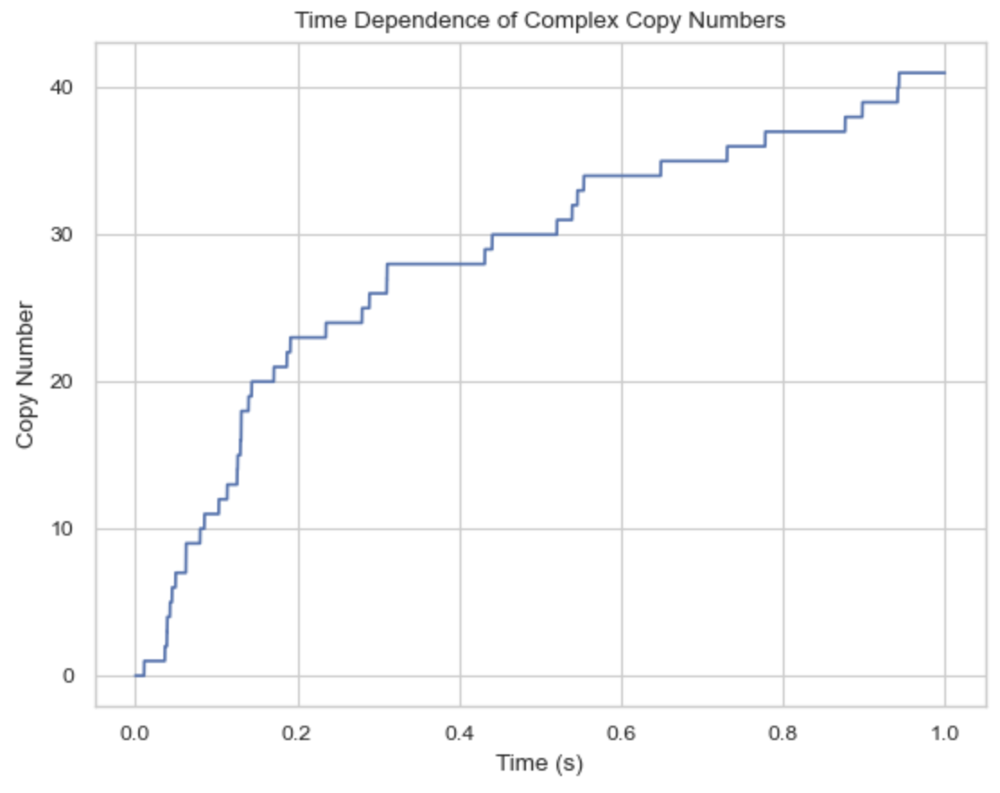

# Read PDB structures from the database and generate NERDSS inputs

This tutorial will explore how to generate inputs for NERDSS using the real PDB structure with the [Yeast TFIIK Complex](https://www.rcsb.org/structure/6XI8) as an example. Download the PDB file and save it under your working directory.

## Install and Import the library

```bash
pip install ioNERDSS
```

```pthon
import ioNERDSS as ion
```

## Visualize the PDB structure

This PDB structure has 3 chains. Each chain will be modeled to a molecule type in NERDSS simulation. And the molecules can assemble into the complex.


## Use ioNERDSS to construct the coarse-grained structure

```python
ion.cg('6xi8', 3.5)
```

The coarse-graind structure is saved as output.pdb. Following is the visualization of the original structure and the coarse-grained structure:



The output for NERDSS input structure parameters:

```bash
COM of chain C: 8.560, 9.803, 10.088
Interfaces of chain C: CA partner chain: A 8.936 10.472 9.434 energy: 91.000
CB partner chain: B 8.827 9.069 10.649 energy: 100.310

COM of chain A: 9.204, 10.077, 7.857
Interfaces of chain A: AC partner chain: C 9.016 10.492 9.302 energy: 91.000
AB partner chain: B 10.524 9.176 8.997 energy: 61.450

COM of chain B: 10.686, 8.405, 10.765
Interfaces of chain B: BC partner chain: C 8.893 9.041 10.748 energy: 100.310
BA partner chain: A 10.544 9.154 9.213 energy: 61.450

output.pdb has been generated.
nerdss input parameters:
mol C:
  com 0.000 0.000 0.000
  CA [0.376, 0.669, -0.654]
      partner A
      partner interface: AC
      theta1 2.548 theta2 2.563 phi1 -0.749 phi2 1.886 omega 0.808
      [2.548, 2.563, -0.749, 1.886, 0.808]
      n1 0.000 0.000 1.000
      n2 0.000 0.000 1.000
       sigma 0.156
       energy 91.000
  CB [0.267, -0.733, 0.560]
      partner B
      partner interface: BC
      theta1 2.496 theta2 2.205 phi1 2.351 phi2 -0.047 omega -1.672
      [2.496, 2.205, 2.351, -0.047, -1.672]
      n1 0.000 0.000 1.000
      n2 0.000 0.000 1.000
       sigma 0.122
       energy 100.310
mol A:
  com 0.000 0.000 0.000
  AC [-0.188, 0.415, 1.446]
      partner C
      partner interface: CA
      theta1 2.563 theta2 2.548 phi1 1.886 phi2 -0.749 omega 0.808
      [2.563, 2.548, 1.886, -0.749, 0.808]
      n1 0.000 0.000 1.000
      n2 0.000 0.000 1.000
       sigma 0.156
       energy 91.000
  AB [1.320, -0.900, 1.141]
      partner B
      partner interface: BA
      theta1 2.327 theta2 2.797 phi1 -3.097 phi2 0.218 omega 2.128
      [2.327, 2.797, -3.097, 0.218, 2.128]
      n1 0.000 0.000 1.000
      n2 0.000 0.000 1.000
       sigma 0.218
       energy 61.450
mol B:
  com 0.000 0.000 0.000
  BC [-1.793, 0.636, -0.017]
      partner C
      partner interface: CB
      theta1 2.205 theta2 2.496 phi1 -0.047 phi2 2.351 omega -1.672
      [2.205, 2.496, -0.047, 2.351, -1.672]
      n1 0.000 0.000 1.000
      n2 0.000 0.000 1.000
       sigma 0.122
       energy 100.310
  BA [-0.142, 0.749, -1.552]
      partner A
      partner interface: AB
      theta1 2.797 theta2 2.327 phi1 0.218 phi2 -3.097 omega 2.128
      [2.797, 2.327, 0.218, -3.097, 2.128]
      n1 0.000 0.000 1.000
      n2 0.000 0.000 1.000
       sigma 0.218
       energy 61.450
```

## Prepare the NERDSS inputs

Following are the input files for the NERDSS simulation based on the above outputs:

[A.mol](./NERDSSInputs/pdbdemo/A.mol)

```bash
##
# A molecule information file
##

Name = A
checkOverlap = true

# translational diffusion constants
D = [10.0, 10.0, 10.0]

# rotational diffusion constants
Dr = [0.02, 0.02, 0.02]

# Coordinates
COM    0.0000    0.0000    0.0000
AC    -0.1880    0.4150    1.4460
AB     1.3200   -0.9000    1.1410

# bonds for visualization only.
bonds = 2
com AC
com AB
```

[B.mol](./NERDSSInputs/pdbdemo/B.mol)

```bash
##
# B molecule information file
##

Name = B
checkOverlap = true

# translational diffusion constants
D = [10.0, 10.0, 10.0]

# rotational diffusion constants
Dr = [0.02, 0.02, 0.02]

# Coordinates
COM    0.0000    0.0000    0.0000
BC    -1.7930    0.6360   -0.0170
BA    -0.1420    0.7490   -1.5520

# bonds for visualization only.
bonds = 2
com BC
com BA
```

[C.mol](./NERDSSInputs/pdbdemo/C.mol)

```bash
##
# C molecule information file
##

Name = C
checkOverlap = true

# translational diffusion constants
D = [10.0, 10.0, 10.0]

# rotational diffusion constants
Dr = [0.02, 0.02, 0.02]

# Coordinates
COM    0.0000    0.0000    0.0000
CA     0.3760    0.6690   -0.6540
CB     0.2670   -0.7330    0.5600

# bonds for visualization only.
bonds = 2
com CA
com CB
```

[parm.inp](./NERDSSInputs/pdbdemo/parm.inp)

```bash
# Input file

start parameters
    nItr = 10000000
    timeStep = 0.1

    timeWrite = 1000
    trajWrite = 10000000
    pdbWrite = 100000
    restartWrite = 100000
    scaleMaxDisplace = 100.0
    overlapSepLimit = 2.0
end parameters

start boundaries
    WaterBox = [200,200,200]
end boundaries

start molecules
    A : 50
    B : 50
    C : 50
end molecules

start reactions
    #### A - C ####
    A(AC) + C(CA) <-> A(AC!1).C(CA!1)
    onRate3Dka = 0.91
    offRatekb = 0.1
    sigma = 0.156
    norm1 = [0,0,1]
    norm2 = [0,0,1]
    assocAngles = [2.563, 2.548, 1.886, -0.749, 0.808]
    excludeVolumeBound = True

    #### A - B ####
    A(AB) + B(BA) <-> A(AB!1).B(BA!1)
    onRate3Dka = 0.61
    offRatekb = 0.1
    sigma = 0.218
    norm1 = [0,0,1]
    norm2 = [0,0,1]
    assocAngles = [2.327, 2.797, -3.097, 0.218, 2.128]
    excludeVolumeBound = True

    #### B - C ####
    B(BC) + C(CB) <-> B(BC!1).C(CB!1)
    onRate3Dka = 1
    offRatekb = 0.1
    sigma = 0.122
    norm1 = [0,0,1]
    norm2 = [0,0,1]
    assocAngles = [2.205, 2.496, -0.047, 2.351, -1.672]
    excludeVolumeBound = True
end reactions
```

## Run the NERDSS simulation

```bash
./nerdss -f parm.inp > output.log
```

## Analyze the NERDSS outputs

[histogram_complexes_time.dat](./NERDSSInputs/pdbdemo/histogram_complexes_time.dat)

```bash
Time (s): 0
50	A: 1. 
50	B: 1. 
50	C: 1. 
Time (s): 0.0001
50	A: 1. 
50	B: 1. 
50	C: 1. 
Time (s): 0.0002
50	A: 1. 
50	B: 1. 
50	C: 1. 

...

Time (s): 0.9999
41	A: 1. B: 1. C: 1. 
5	A: 1. C: 1. 
4	B: 1. C: 1. 
4	A: 1. B: 1. 
1	B: 1. 
Time (s): 1
41	A: 1. B: 1. C: 1. 
5	A: 1. C: 1. 
4	B: 1. C: 1. 
4	A: 1. B: 1. 
1	B: 1. 
```

```python
import ioNERDSS as ion


filename = './histogram_complexes_time.dat'
desired_components = ["A: 1", "B: 1", "C: 1"]
times, counts = ion.get_time_dependence(filename, desired_components)
ion.plot_time_dependence(times, counts)
```


