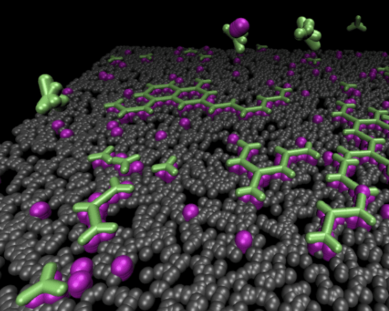

# Welcome to NERDSS Tutorials

Welcome to the official tutorials for NERDSS, NonEquilibrium Reaction-Diffusion Self-assembly Simulator.

NERDSS is a state-of-the-art scientific software designed to help researchers simulate the structure-resolved reaction-diffusion model in cell.

---

## Getting Started

- [Installation Guide](installation.md)
- [Basic Usage](basic_usage.md)

---

## Tutorials

Dive deep into specific features and use-cases with our detailed tutorials.

- [Tutorial 1: Get Molecule Geometry from PDB Structure](getMolGeometryFromPDBStructure.md)
- [Tutorial 2: Clathrin Assembly](clathrinAssembly.md)
- [Tutorial 3: Virus Assembly](virusAssembly.md)
- [Tutorial 4: Data Analysis of Output](dataAnalysis.md)

---

## Community & Support

- [GitHub Repository](https://github.com/mjohn218/NERDSS)
- [FAQs](faqs.md)

---

## Publications

- [Full Publication List](pub.md)

---

We ask that you cite: Varga, M., Fu, Y., Loggia, S., Yogurtcu, O.N., & M.E. Johnson NERDSS: a nonequilibrium simulator for multibody self-assembly at the cellular scale. Biophysical Journal 118, P3026-P3040 (2020) in all publications that make use of NERDSS.
